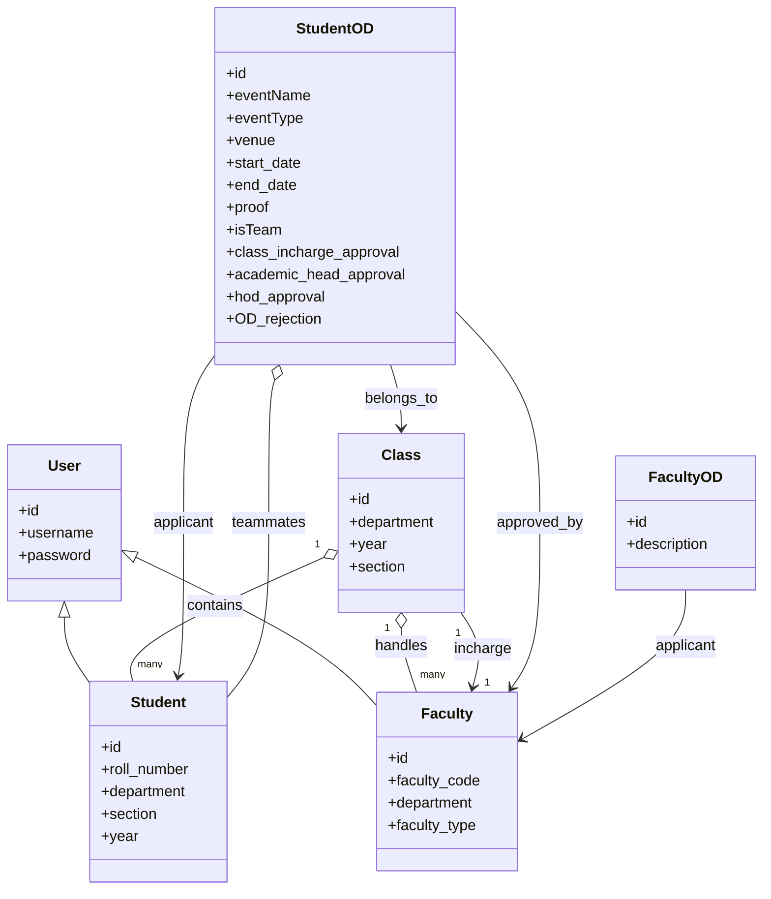

# 🎓 OD Management System (College)

## 📌 Overview

This project develops a **web-based application** to manage the **On Duty (OD) approval process** in our college. It replaces the manual, paper-based system with a digital workflow.

* **Current Process**: Students write a letter, attach evidence, get sequential signatures (**Class Incharge → Academic Head → HOD**), and then share the OD with faculty handling classes that day.
* **Goal**: Automate OD requests, approvals, and notifications.
* **Output**: Role-based dashboards for students and faculty, OD status tracking, and digital records.

---

## 🏗 Tech Stack

**Backend & Frontend**

* Django (Django Templates for UI)
* Django ORM for database models

**Database Models**

* `Student`: Roll number, department, section, year
* `Faculty`: Faculty code, department, role (HOD, Academic Head, Class Incharge, etc.)
* `Class`: Section, year, department, with mapped students & faculty
* `student_OD`: OD requests with event details, dates, approvals
* `faculty_OD`: OD requests by faculty

**Other**

* Excel import support with `openpyxl`
* File uploads (evidence proofs)

---

## 🔄 Workflow / Approach

### 1. Student Request

* Student logs in with roll number.
* Applies for OD with event details, dates, and uploads proof.
* Can add teammates for team ODs.

### 2. Sequential Approval

* Request flows to **Class Incharge**.
* If approved → moves to **Academic Head**.
* If approved → moves to **HOD**.
* At any stage → can be **rejected**.

### 3. Notification & Attendance

* Approved ODs visible in dashboards.
* Faculty can see which students are on OD for their classes/dates.

---

## 📊 Workflow Diagram



---

## 🗂 Data Model (ER Diagram)


---

## ⚡ Features

* 📌 **Student Portal**

  * Apply for OD with event details & evidence.
  * View OD status: Pending / Approved / Rejected.
* 📌 **Faculty Portal**

  * View OD requests to approve.
  * See students on OD in their classes.
* 📌 **HOD Portal**

  * Final approval authority.
  * Filter requests by date.
* 📌 **Team OD Support**

  * Add teammates to a single OD.
* 📌 **Bulk Data Import**

  * Import students, faculty, and class mappings via Excel.

---

## 🛠 Setup Instructions

### 1. Clone Repository

```bash
git clone <your_repo_url>
cd od-management-system
```

### 2. Install Dependencies

```bash
pip install -r requirements.txt
```

### 3. Setup Database

```bash
python manage.py migrate
```

### 4. Create Superuser

```bash
python manage.py createsuperuser
```

### 5. Import Data from Excel

```bash
python manage.py upload_faculty_data
python manage.py upload-student-data
python manage.py upload-class-faculty-data
```

### 6. Run Development Server

```bash
python manage.py runserver
```

---

## 🚀 Future Enhancements

* Replace boolean approvals with a **state machine**.
* Add **email/WhatsApp notifications** for approvals.
* **Calendar integration** for OD events.
* Richer **filters & analytics** in dashboards.

---

## 👥 Authors

* **Your Team / College**
* Contact: *\[Add your email or website]*
